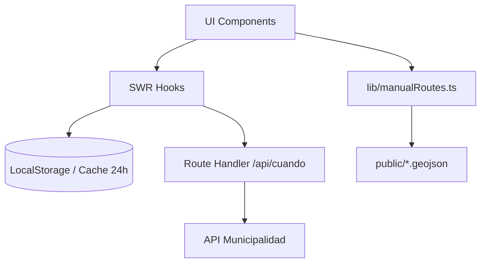

<div align="center">
  

  <h1>Bondi MDP</h1>

  <p>
    <strong>Tiempos de arribo de colectivos en tiempo real para Mar del Plata.</strong>
  </p>

  <p>
    <a href="https://www.bondimdp.com.ar/">Sitio en vivo</a> •
    <a href="#-empezar-getting-started">Empezar</a> •
    <a href="CONTRIBUTING.md">Contribuir</a> •
    <a href="docs/DIATAXIS.md">Documentación (Diátaxis)</a> •
    <a href="#-arquitectura--stack-tecnológico">Arquitectura</a>
  </p>
</div>

---

> [!NOTE]
> Una Progressive Web App (PWA) rápida, moderna y responsiva. Consultá cuándo llega el colectivo a tu parada sin publicidades, sin descargar apps nativas y con posibilidad de funcionar sin conexión (caché).

<div align="center">
  
</div>

## ✨ Funcionalidades

- **Tiempo real (GPS):** Consulta de arribos en tiempo real obteniendo datos del proxy de la Municipalidad de Gral. Pueyrredón.
- **Rutas Manuales (GeoJSON):** Soporte para líneas que no están en la API oficial (ej. Mar Chiquita 221) mediante archivos GeoJSON.
- **Favoritos:** Guardá tus paradas de uso diario con nombres personalizados (ej. "Casa", "Trabajo").
- **Historial inteligente:** Historial automático de las últimas paradas consultadas.
- **Mapa Interactivo Avanzado:** 
    - Visualización de colectivos acercándose en tiempo real.
    - Marcado de paradas con **navegación rápida** (vía Google Maps).
    - Trazado de recorridos completos sobre el mapa.
- **Modo PWA & Caché:** Instalación nativa en móviles e información estática (calles, recorridos) persistida localmente por 24hs.
- **Compartir:** Mensajes rápidos por WhatsApp con tiempos de arribo y ubicación; enlaces al bot de Telegram para seguir un recorrido y (con backend configurado) ubicación en vivo en el mapa.
- **Status de API:** Detección y alerta visual si el servidor de la Municipalidad está fuera de servicio.

## 🛠 Arquitectura & Stack Tecnológico

La aplicación está diseñada pensando en la performance y la facilidad de extensión.

| Tecnología        | Propósito                                                            |
|-------------------|----------------------------------------------------------------------|
| **Next.js 16 (App Router)** | Framework base, optimización de bundles, y proxy `/api/cuando`. |
| **React 19**      | UI responsiva y gestión de estado mediante hooks.                   |
| **Tailwind CSS 4** | Utilidades de estilo; tokens y tema en `app/globals.css`.      |
| **SWR**           | Fetching de datos con revalidación automática y caché en memoria.   |
| **Leaflet**       | Motor de mapas liviano para visualización de GPS y GeoJSON.          |
| **LocalStorage**  | Persistencia de favoritos, historial y caché de calles (24hs TTL).    |
| **Supabase** (opcional) | Backend para ubicación en vivo vinculada al bot de Telegram y el mapa. |

### Flujo de Datos




## 🚀 Empezar (Getting Started)

Estas instrucciones te permitirán obtener una copia del proyecto y ejecutarlo en tu máquina local para desarrollo y pruebas.

### Prerrequisitos

- **Node.js** (v20.x recomendado; mínimo compatible con Next.js 16)
- **npm** (incluido con Node.js)

### Variables de entorno (opcional)

Para la app básica de consulta de arribos no hace falta configurar nada. Para probar **Telegram** (webhook, mensajes del bot) y **ubicación en vivo** en el mapa necesitás:

| Variable | Uso |
|----------|-----|
| `NEXT_PUBLIC_TELEGRAM_BOT_USERNAME` | Usuario del bot (sin `@`) para enlaces `t.me/...`. |
| `TELEGRAM_BOT_TOKEN` | Token del bot; el webhook responde con `sendMessage`. |
| `NEXT_PUBLIC_SUPABASE_URL` | URL del proyecto Supabase. |
| `NEXT_PUBLIC_SUPABASE_ANON_KEY` | Clave anónima (el webhook y el cliente leen/actualizan ubicaciones). |

Los detalles de rutas y tablas están orientados a quien despliega el backend; si no configurás estas variables, la consulta municipal y el mapa estándar siguen funcionando.

### Instalación

1. **Clonar el repositorio:**
   ```bash
   git clone https://github.com/Celiz/cuandollega.git
   cd cuandollega
   ```

2. **Instalar dependencias:**
   ```bash
   npm install
   ```

3. **Ejecutar en entorno de desarrollo:**
   ```bash
   npm run dev
   ```

   La aplicación estará corriendo en [http://localhost:3000](http://localhost:3000).

## 📡 API Reference

Toda la comunicación con la MGP pasa a través de un único proxy en nuestro backend para evadir restricciones de CORS y homogeneizar el cliente.

**Endpoint:** `POST /api/cuando`

El body asume codificación `application/x-www-form-urlencoded`.

### Acciones Comunes

- `RecuperarLineaPorCuandoLlega`: Obtiene lista de líneas.
- `RecuperarCallesPrincipalPorLinea`: Recibe `codLinea`. Retorna calles que recorre.
- `RecuperarInterseccionPorLineaYCalle`: Recibe `codLinea`, `codCalle`. Retorna intersecciones de esa calle en su recorrido.
- `RecuperarParadasConBanderaPorLineaCalleEInterseccion`: Retorna las banderas y el identificador de la parada.
- `RecuperarProximosArribosW`: Recibe `identificadorParada` y `codigoLineaParada`. Retorna la información de tiempo real GPS de arribos.

*(El cliente del proxy está en `lib/api/client.ts` (`post`, `swrFetcher`); las acciones concretas viven en `lib/api/` y los tipos en `lib/types.ts`.)*

## 🤝 Contribuir

¡Las contribuciones (pull requests, reporte de bugs, sugerencias) son bienvenidas!

Revisá [CONTRIBUTING.md](CONTRIBUTING.md) para el árbol del repo, convenciones y PRs. Para nuevos textos de documentación, el marco está en [docs/DIATAXIS.md](docs/DIATAXIS.md).

## 📄 Licencia

Este proyecto se distribuye bajo la licencia **MIT**. Consultá el archivo [LICENSE](LICENSE) para más detalles.

---

> [!TIP]
> Si la app te es útil, apreciamos una estrella ⭐ en el [repositorio de GitHub](https://github.com/Celiz/cuandollega).
