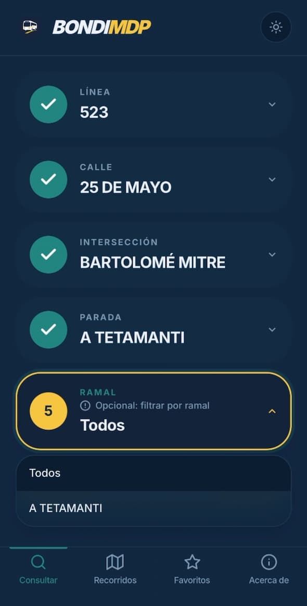
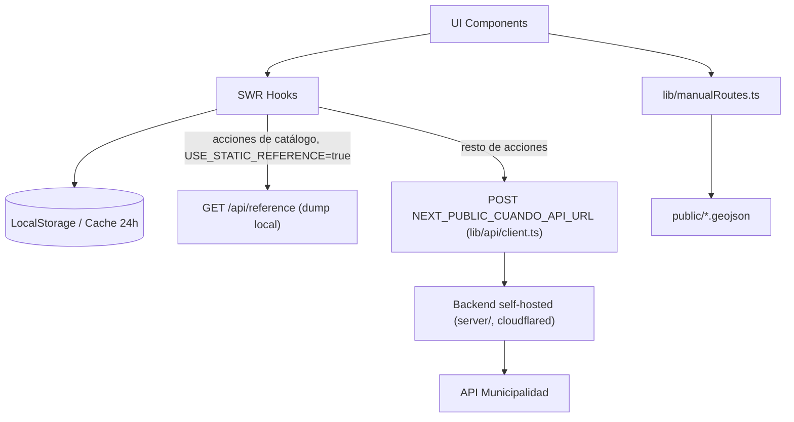

<div align="center">
  

  <h1>Bondi MDP</h1>

  <p>
    <strong>Tiempos de arribo de colectivos en tiempo real para Mar del Plata.</strong>
  </p>

  <p>
    <a href="https://www.bondimdp.com.ar/">Sitio en vivo</a> •
    <a href="#-empezar-getting-started">Empezar</a> •
    <a href="CONTRIBUTING.md">Contribuir</a> •
    <a href="docs/DIATAXIS.md">Documentación (Diátaxis)</a> •
    <a href="#-arquitectura--stack-tecnológico">Arquitectura</a>
  </p>
</div>

---

> [!NOTE]
> Una Progressive Web App (PWA) rápida, moderna y responsiva. Consultá cuándo llega el colectivo a tu parada sin publicidades, sin descargar apps nativas y con posibilidad de funcionar sin conexión (caché).

<div align="center">
  
</div>

## ✨ Funcionalidades

- **Tiempo real (GPS):** Consulta de arribos en tiempo real obteniendo datos del proxy de la Municipalidad de Gral. Pueyrredón.
- **Rutas Manuales (GeoJSON):** Soporte para líneas que no están en la API oficial (ej. Mar Chiquita 221) mediante archivos GeoJSON.
- **Favoritos:** Guardá tus paradas de uso diario con nombres personalizados (ej. "Casa", "Trabajo").
- **Historial inteligente:** Historial automático de las últimas paradas consultadas.
- **Mapa Interactivo Avanzado:**
  - Visualización de colectivos acercándose en tiempo real.
  - Marcado de paradas con **navegación rápida** (vía Google Maps).
  - Trazado de recorridos completos sobre el mapa.
- **Modo PWA & Caché:** Instalación nativa en móviles e información estática (calles, recorridos) persistida localmente por 24hs.
- **Compartir:** Mensajes rápidos por WhatsApp con tiempos de arribo y ubicación; enlaces al bot de Telegram para seguir un recorrido y (con backend configurado) ubicación en vivo en el mapa.
- **Status de API:** Detección y alerta visual si el servidor de la Municipalidad está fuera de servicio.

## 🛠 Arquitectura & Stack Tecnológico

La aplicación está diseñada pensando en la performance y la facilidad de extensión.

| Tecnología                  | Propósito                                                              |
| --------------------------- | ---------------------------------------------------------------------- |
| **Next.js 16 (App Router)** | Framework base, optimización de bundles, y proxy `/api/cuando`.        |
| **React 19**                | UI responsiva y gestión de estado mediante hooks.                      |
| **Tailwind CSS 4**          | Utilidades de estilo; tokens y tema en `app/globals.css`.              |
| **SWR**                     | Fetching de datos con revalidación automática y caché en memoria.      |
| **Leaflet**                 | Motor de mapas liviano para visualización de GPS y GeoJSON.            |
| **LocalStorage**            | Persistencia de favoritos, historial y caché de calles (24hs TTL).     |
| **Supabase** (opcional)     | Backend para ubicación en vivo vinculada al bot de Telegram y el mapa. |

### Flujo de Datos



### Backend self-hosted obligatorio

La API municipal bloquea el rango de IPs de Vercel, así que **este front no tiene proxy interno**: no existe `/api/cuando`. El cliente (`post()` en `lib/api/client.ts`) hace `POST` directo a `NEXT_PUBLIC_CUANDO_API_URL`, que apunta al backend self-hosted (ver `server/`, expuesto vía cloudflared/traefik). Si la env var no está configurada, `post()` tira un error explícito en el primer uso en lugar de pegarle a un endpoint inexistente.

Las acciones de catálogo (líneas, calles, paradas, recorridos, banderas) las atiende `/api/reference` desde un dump estático en `data/mgp-static-dump.json` cuando `NEXT_PUBLIC_USE_STATIC_REFERENCE=true`. Esa ruta vive en Vercel sin riesgo: nunca toca la muni.

## 🚀 Empezar (Getting Started)

Estas instrucciones te permitirán obtener una copia del proyecto y ejecutarlo en tu máquina local para desarrollo y pruebas.

### Prerrequisitos

- **Node.js** (v20.x recomendado; mínimo compatible con Next.js 16)
- **npm** (incluido con Node.js)

### Variables de entorno

**Consulta municipal (obligatorio):** `NEXT_PUBLIC_CUANDO_API_URL` apunta al backend self-hosted. Sin esa variable las acciones en vivo (arribos, banderas, etc.) fallan en el primer uso con un error explícito. La muni bloquea las IPs de Vercel; no hay fallback.

| Variable                            | Uso                                                                 |
| ----------------------------------- | ------------------------------------------------------------------- |
| `NEXT_PUBLIC_CUANDO_API_URL`        | URL base del backend self-hosted (ej. `https://bondi.aeterna.red`)  |
| `NEXT_PUBLIC_USE_STATIC_REFERENCE`  | `true` para servir catálogo desde `data/mgp-static-dump.json`        |
| `NEXT_PUBLIC_TELEGRAM_BOT_USERNAME` | Usuario del bot (sin `@`) para enlaces `t.me/...`                   |
| `TELEGRAM_BOT_TOKEN`                | Token del bot; el webhook responde con `sendMessage`               |
| `NEXT_PUBLIC_SUPABASE_URL`          | URL del proyecto Supabase                                          |
| `NEXT_PUBLIC_SUPABASE_ANON_KEY`     | Clave anónima (webhook + cliente de ubicación en vivo)              |
| `NEXT_PUBLIC_GA_MEASUREMENT_ID`     | Opcional: Google Analytics (layout)                                 |
| `NEXT_PUBLIC_CLARITY_PROJECT_ID`    | Opcional: Microsoft Clarity                                        |

Si no configurás Telegram ni Supabase, el resto de la app sigue funcionando; lo único realmente obligatorio es `NEXT_PUBLIC_CUANDO_API_URL` para que el cliente sepa a dónde mandar las acciones en vivo.

### Instalación

1. **Clonar el repositorio:**

   ```bash
   git clone https://github.com/cuando-llega-mi-bondi/cuando-llega-mi-bondi.git
   cd cuando-llega-mi-bondi
   ```

2. **Instalar dependencias:**

   ```bash
   npm install
   ```

3. **Ejecutar en entorno de desarrollo:**

   ```bash
   npm run dev
   ```

   La aplicación estará corriendo en [http://localhost:3000](http://localhost:3000).

   Configurá `NEXT_PUBLIC_CUANDO_API_URL` en `.env.local` apuntando al backend self-hosted (local o tunelado vía cloudflared); si no, todas las acciones en vivo van a tirar error.

## 📡 API Reference

El cliente (`post` en `lib/api/client.ts`) envía todas las acciones por `POST` con `application/x-www-form-urlencoded` a `NEXT_PUBLIC_CUANDO_API_URL`. Las acciones de catálogo (ver `lib/staticReferenceAcciones.ts`) se cortan antes con un `GET /api/reference?accion=...` que sirve el dump estático.

### Acciones comunes

- `RecuperarLineaPorCuandoLlega`: Lista de líneas (cache servidor ~300 s).
- `RecuperarCallesPrincipalPorLinea`: `codLinea` → calles del recorrido (cache).
- `RecuperarInterseccionPorLineaYCalle`: `codLinea`, `codCalle` → intersecciones (cache).
- `RecuperarParadasConBanderaPorLineaCalleEInterseccion`: paradas/banderas e identificador (cache).
- `RecuperarRecorridoParaMapaAbrevYAmpliPorEntidadYLinea`: geometría de mapa (cache).
- `RecuperarParadasConBanderaYDestinoPorLinea`: paradas con destino por línea (cache).
- `RecuperarBanderasAsociadasAParada`: banderas asociadas a una parada (cache).
- `RecuperarProximosArribosW`: `identificadorParada`, `codigoLineaParada` → arribos GPS en vivo (**sin** cache servidor).

_(El cliente está en `lib/api/client.ts` (`post`, `swrFetcher`); las acciones que se atienden desde el dump estático están listadas en `lib/staticReferenceAcciones.ts`.)_

## 🤝 Contribuir

¡Las contribuciones (pull requests, reporte de bugs, sugerencias) son bienvenidas!

Revisá [CONTRIBUTING.md](CONTRIBUTING.md) para el árbol del repo, convenciones y PRs. Para nuevos textos de documentación, el marco está en [docs/DIATAXIS.md](docs/DIATAXIS.md).

## 📄 Licencia

Este proyecto se distribuye bajo la licencia **MIT**. Consultá el archivo [LICENSE](LICENSE) para más detalles.

---

> [!TIP]
> Si la app te es útil, apreciamos una estrella ⭐ en el [repositorio de GitHub](https://github.com/cuando-llega-mi-bondi/cuando-llega-mi-bondi).
