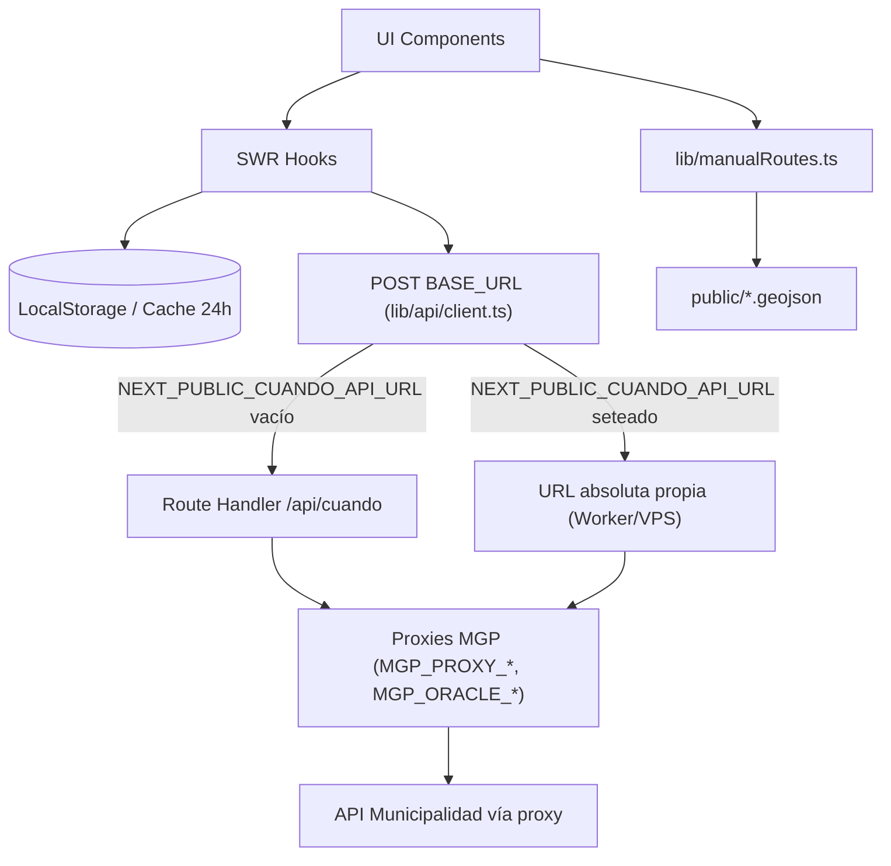

<div align="center">
  

  <h1>Bondi MDP</h1>

  <p>
    <strong>Tiempos de arribo de colectivos en tiempo real para Mar del Plata.</strong>
  </p>

  <p>
    <a href="https://www.bondimdp.com.ar/">Sitio en vivo</a> •
    <a href="#-empezar-getting-started">Empezar</a> •
    <a href="CONTRIBUTING.md">Contribuir</a> •
    <a href="docs/DIATAXIS.md">Documentación (Diátaxis)</a> •
    <a href="#-arquitectura--stack-tecnológico">Arquitectura</a>
  </p>
</div>

---

> [!NOTE]
> Una Progressive Web App (PWA) rápida, moderna y responsiva. Consultá cuándo llega el colectivo a tu parada sin publicidades, sin descargar apps nativas y con posibilidad de funcionar sin conexión (caché).

<div align="center">
  
</div>

## ✨ Funcionalidades

- **Tiempo real (GPS):** Consulta de arribos en tiempo real obteniendo datos del proxy de la Municipalidad de Gral. Pueyrredón.
- **Rutas Manuales (GeoJSON):** Soporte para líneas que no están en la API oficial (ej. Mar Chiquita 221) mediante archivos GeoJSON.
- **Favoritos:** Guardá tus paradas de uso diario con nombres personalizados (ej. "Casa", "Trabajo").
- **Historial inteligente:** Historial automático de las últimas paradas consultadas.
- **Mapa Interactivo Avanzado:**
  - Visualización de colectivos acercándose en tiempo real.
  - Marcado de paradas con **navegación rápida** (vía Google Maps).
  - Trazado de recorridos completos sobre el mapa.
- **Modo PWA & Caché:** Instalación nativa en móviles e información estática (calles, recorridos) persistida localmente por 24hs.
- **Compartir:** Mensajes rápidos por WhatsApp con tiempos de arribo y ubicación; enlaces al bot de Telegram para seguir un recorrido y (con backend configurado) ubicación en vivo en el mapa.
- **Status de API:** Detección y alerta visual si el servidor de la Municipalidad está fuera de servicio.

## 🛠 Arquitectura & Stack Tecnológico

La aplicación está diseñada pensando en la performance y la facilidad de extensión.

| Tecnología                  | Propósito                                                              |
| --------------------------- | ---------------------------------------------------------------------- |
| **Next.js 16 (App Router)** | Framework base, optimización de bundles, y proxy `/api/cuando`.        |
| **React 19**                | UI responsiva y gestión de estado mediante hooks.                      |
| **Tailwind CSS 4**          | Utilidades de estilo; tokens y tema en `app/globals.css`.              |
| **SWR**                     | Fetching de datos con revalidación automática y caché en memoria.      |
| **Leaflet**                 | Motor de mapas liviano para visualización de GPS y GeoJSON.            |
| **LocalStorage**            | Persistencia de favoritos, historial y caché de calles (24hs TTL).     |
| **Supabase** (opcional)     | Backend para ubicación en vivo vinculada al bot de Telegram y el mapa. |

### Flujo de Datos



### Proxy municipal y offload del cliente

El navegador **no** llama directo al origen municipal: siempre hace `POST` a `BASE_URL` (`lib/api/client.ts`). Por defecto eso es la ruta interna `/api/cuando` (`app/api/cuando/route.ts`), que a su vez reenvía el body a uno o más **proxies intermedios** configurados con variables de entorno (ver tabla más abajo). Si un proxy falla (red, sesión, 403/503), la ruta intenta el siguiente; ante sesión rota llama a `/init` del mismo host antes de reintentar.

Si querés que el tráfico **no** pase por el Route Handler de Next (por ejemplo para ahorrar invocaciones o montar tu propio Worker), definí `NEXT_PUBLIC_CUANDO_API_URL` con la base HTTPS de tu endpoint compatible (mismo contrato: `POST` con `application/x-www-form-urlencoded` y el mismo cuerpo que hoy arma `post()`). El cliente deja de usar `/api/cuando` en build/runtime; igual necesitás que ese endpoint llegue al proxy municipal de tu infraestructura.

Las respuestas de **datos de referencia** (líneas, calles, paradas, recorridos para mapa, etc.) se cachean en el servidor con `unstable_cache` unos **300 segundos**; `RecuperarProximosArribosW` (arribos en vivo) **no** se cachea.

## 🚀 Empezar (Getting Started)

Estas instrucciones te permitirán obtener una copia del proyecto y ejecutarlo en tu máquina local para desarrollo y pruebas.

### Prerrequisitos

- **Node.js** (v20.x recomendado; mínimo compatible con Next.js 16)
- **npm** (incluido con Node.js)

### Variables de entorno

**Consulta municipal (obligatorio en servidor si usás `/api/cuando`):** el Route Handler necesita al menos una base de proxy. Podés definir `MGP_PROXY_URL` (y opcionalmente `MGP_PROXY_TOKEN`) y/o un segundo origen `MGP_ORACLE_URL` (y `MGP_ORACLE_TOKEN`). Si omitís el token, se usa un valor por defecto interno al código. Sin ninguna URL, `/api/cuando` responde error (no hay a dónde reenviar).

**Alternativa en local:** apuntá el cliente a un proxy ya desplegado con `NEXT_PUBLIC_CUANDO_API_URL` (URL HTTPS absoluta o host sin esquema; ver `lib/api/client.ts`). Así el navegador no llama a tu `/api/cuando` y no necesitás `MGP_PROXY_*` en ese entorno de Next.

| Variable                            | Uso                                                                 |
| ----------------------------------- | ------------------------------------------------------------------- |
| `MGP_PROXY_URL`                     | Base del proxy Termux (sin barra final); ej. `https://host.example` |
| `MGP_PROXY_TOKEN`                   | Token enviado como `x-proxy-token` (opcional; hay default)          |
| `MGP_ORACLE_URL`                    | Segundo proxy (Oracle); se deduplica si coincide con el primero     |
| `MGP_ORACLE_TOKEN`                  | Token del segundo proxy (opcional)                                  |
| `NEXT_PUBLIC_CUANDO_API_URL`        | Base externa para `post()`; si está vacío se usa `/api/cuando`       |
| `NEXT_PUBLIC_TELEGRAM_BOT_USERNAME` | Usuario del bot (sin `@`) para enlaces `t.me/...`                   |
| `TELEGRAM_BOT_TOKEN`                | Token del bot; el webhook responde con `sendMessage`               |
| `NEXT_PUBLIC_SUPABASE_URL`          | URL del proyecto Supabase                                          |
| `NEXT_PUBLIC_SUPABASE_ANON_KEY`     | Clave anónima (webhook + cliente de ubicación en vivo)              |
| `NEXT_PUBLIC_GA_MEASUREMENT_ID`     | Opcional: Google Analytics (layout)                                 |
| `NEXT_PUBLIC_CLARITY_PROJECT_ID`    | Opcional: Microsoft Clarity                                        |

Si no configurás Telegram ni Supabase, la consulta de arribos y el mapa estándar pueden funcionar igual; lo que no podés omitir (salvo el caso `NEXT_PUBLIC_CUANDO_API_URL`) es la cadena hasta el proxy municipal.

### Instalación

1. **Clonar el repositorio:**

   ```bash
   git clone https://github.com/cuando-llega-mi-bondi/cuando-llega-mi-bondi.git
   cd cuando-llega-mi-bondi
   ```

2. **Instalar dependencias:**

   ```bash
   npm install
   ```

3. **Ejecutar en entorno de desarrollo:**

   ```bash
   npm run dev
   ```

   La aplicación estará corriendo en [http://localhost:3000](http://localhost:3000).

   Sin `NEXT_PUBLIC_CUANDO_API_URL`, asegurate de tener en `.env.local` al menos `MGP_PROXY_URL` o `MGP_ORACLE_URL` (ver arriba); si no, las consultas a la API municipal van a responder error.

## 📡 API Reference

El cliente (`post` en `lib/api/client.ts`) envía todas las acciones al mismo `BASE_URL`: por defecto **`POST /api/cuando`** relativo al sitio; si definís `NEXT_PUBLIC_CUANDO_API_URL`, ese mismo contrato aplica contra la URL absoluta configurada.

**Endpoint interno (Next):** `POST /api/cuando`

El body asume codificación `application/x-www-form-urlencoded`.

### Acciones comunes

- `RecuperarLineaPorCuandoLlega`: Lista de líneas (cache servidor ~300 s).
- `RecuperarCallesPrincipalPorLinea`: `codLinea` → calles del recorrido (cache).
- `RecuperarInterseccionPorLineaYCalle`: `codLinea`, `codCalle` → intersecciones (cache).
- `RecuperarParadasConBanderaPorLineaCalleEInterseccion`: paradas/banderas e identificador (cache).
- `RecuperarRecorridoParaMapaAbrevYAmpliPorEntidadYLinea`: geometría de mapa (cache).
- `RecuperarParadasConBanderaYDestinoPorLinea`: paradas con destino por línea (cache).
- `RecuperarBanderasAsociadasAParada`: banderas asociadas a una parada (cache).
- `RecuperarProximosArribosW`: `identificadorParada`, `codigoLineaParada` → arribos GPS en vivo (**sin** cache servidor).

_(El cliente está en `lib/api/client.ts` (`post`, `swrFetcher`); la lista exacta de acciones con cache en servidor coincide con `CACHEABLE_ACCIONES` en `app/api/cuando/route.ts`.)_

## 🤝 Contribuir

¡Las contribuciones (pull requests, reporte de bugs, sugerencias) son bienvenidas!

Revisá [CONTRIBUTING.md](CONTRIBUTING.md) para el árbol del repo, convenciones y PRs. Para nuevos textos de documentación, el marco está en [docs/DIATAXIS.md](docs/DIATAXIS.md).

## 📄 Licencia

Este proyecto se distribuye bajo la licencia **MIT**. Consultá el archivo [LICENSE](LICENSE) para más detalles.

---

> [!TIP]
> Si la app te es útil, apreciamos una estrella ⭐ en el [repositorio de GitHub](https://github.com/cuando-llega-mi-bondi/cuando-llega-mi-bondi).
