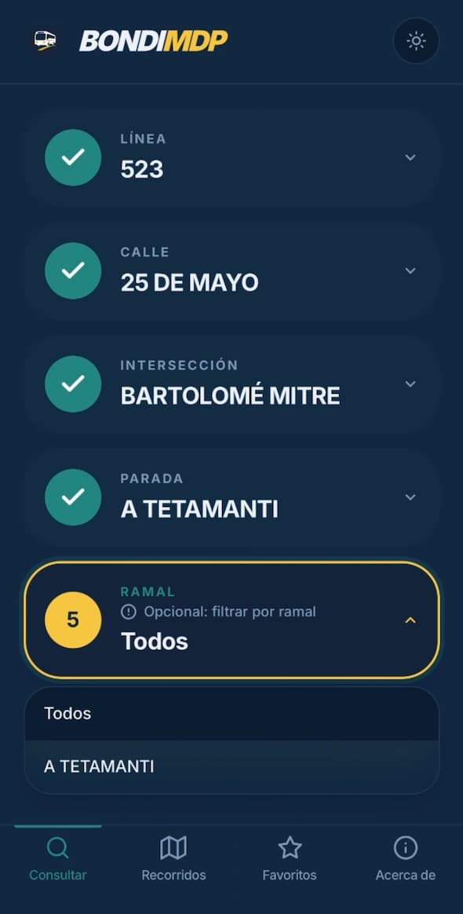
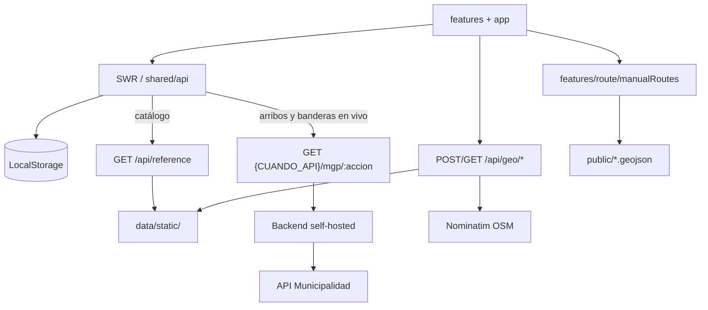

<div align="center">
  

  <h1>Bondi MDP</h1>

  <p>
    <strong>Tiempos de arribo de colectivos en tiempo real para Mar del Plata.</strong>
  </p>

  <p>
    <a href="https://bondimdp.com.ar/">Sitio en vivo</a> •
    <a href="#-empezar-getting-started">Empezar</a> •
    <a href="CONTRIBUTING.md">Contribuir</a> •
    <a href="docs/DIATAXIS.md">Documentación (Diátaxis)</a> •
    <a href="docs/architecture.md">Arquitectura</a>
  </p>
</div>

---

> [!NOTE]
> Progressive Web App (PWA) rápida y responsiva. Consultá cuándo llega el colectivo a tu parada sin publicidades, sin apps nativas y con caché local para datos estáticos.

<div align="center">
  
</div>

## ✨ Funcionalidades

- **Tiempo real (GPS):** Arribos en vivo vía backend self-hosted que consulta la API de la Municipalidad de Gral. Pueyrredón.
- **Rutas manuales (GeoJSON):** Líneas fuera de la API oficial (ej. 221 Costa Azul) con uno o más ramales en `public/*.geojson`.
- **Cómo llego:** Planificador multimodal (caminata + colectivo) sobre el grafo estático de paradas y recorridos. Algoritmo y modelo de costos: [docs/trip-planner.md](docs/trip-planner.md).
- **Paradas cercanas:** Búsqueda por geolocalización usando el catálogo en `data/static/`.
- **Favoritos:** Paradas con nombre personalizado (ej. «Casa», «Trabajo»).
- **Historial:** Últimas paradas consultadas, persistidas en el dispositivo.
- **Mapa interactivo:** Colectivos en vivo, paradas, recorridos, enlace a Google Maps.
- **PWA y caché:** Instalable en móviles; catálogo MGP servido desde dump local con revalidación larga en CDN.
- **Compartir:** WhatsApp, Telegram y (con Supabase) ubicación en vivo en el mapa.
- **Estado del servicio:** Alerta si el backend municipal no responde.

## 🛠 Arquitectura y stack

El código sigue una **Screaming Architecture** orientada al dominio: `features/` agrupa casos de uso (`arrivals`, `search`, `trip-planner`, …), con `shared/` para lo transversal y `app/` como capa de rutas Next.js. Ver [docs/architecture.md](docs/architecture.md#screaming-architecture-intención).

| Tecnología | Propósito |
| ---------- | --------- |
| **Next.js 16 (App Router)** | Framework, rutas API internas (`/api/reference`, `/api/geo/*`) y despliegue en Vercel. |
| **React 19** | UI con hooks y React Compiler. |
| **Tailwind CSS 4** | Estilos; tokens en `app/globals.css`. |
| **SWR** | Datos con revalidación; cliente en `shared/api/client.ts`. |
| **Leaflet / react-leaflet** | Mapas, GeoJSON y marcadores. |
| **LocalStorage** | Favoritos, historial y caché de calles (TTL 24 h). |
| **Supabase** (opcional) | Ubicación en vivo vinculada al bot de Telegram. |

Diagrama detallado y decisiones de diseño: [docs/architecture.md](docs/architecture.md).

### Flujo de datos (resumen)


```mermaid
graph TD
  UI[features + app] --> SWR[SWR / shared/api]
  SWR --> LS[(LocalStorage)]
  SWR -->|catálogo| Ref["GET /api/reference"]
  Ref --> Static["data/static/"]
  SWR -->|arribos y banderas en vivo| MGP["GET {CUANDO_API}/mgp/:accion"]
  MGP --> Backend[Backend self-hosted]
  Backend --> Mun[API Municipalidad]
  UI --> Geo["POST/GET /api/geo/*"]
  Geo --> Static
  Geo --> OSM[Nominatim OSM]
  UI --> Manual[features/route/manualRoutes]
  Manual --> GJ[public/*.geojson]
```

### Backend self-hosted (obligatorio para datos en vivo)

La API municipal bloquea las IPs de Vercel. **Este repositorio no incluye proxy municipal** (`/api/cuando` no existe). El cliente (`post()` en `shared/api/client.ts`) llama al backend externo configurado en `NEXT_PUBLIC_CUANDO_API_URL` con `GET /mgp/{accion}?params`.

El catálogo (líneas, calles, paradas, recorridos) se sirve desde **`GET /api/reference`** leyendo `data/static/`, generado a partir de `data/mgp-static-dump.json`. Esa ruta es segura en Vercel: no contacta a la muni.

## 🚀 Empezar (Getting Started)

### Prerrequisitos

- **Node.js** v20.x (recomendado; runtime de Next)
- **Bun** v1.x (gestor de paquetes y runner de scripts)

### Variables de entorno

Copiá `.env.example` a `.env.local` y completá al menos:

| Variable | Obligatoria | Uso |
| -------- | ----------- | --- |
| `NEXT_PUBLIC_CUANDO_API_URL` | Sí (arribos en vivo) | URL del backend self-hosted (ej. `https://bondi.example.com`) |
| `NEXT_PUBLIC_USE_STATIC_REFERENCE` | No (default `true`) | Catálogo desde dump local vía `/api/reference` |

Telegram, Supabase, analytics y el resto: [docs/env-reference.md](docs/env-reference.md).

### Instalación

1. **Clonar:**

   ```bash
   git clone https://github.com/cuando-llega-mi-bondi/cuando-llega-mi-bondi.git
   cd cuando-llega-mi-bondi
   ```

2. **Dependencias:**

   ```bash
   bun install
   ```

3. **Desarrollo:**

   ```bash
   bun run dev
   ```

   Abrí [http://localhost:3000](http://localhost:3000).

   Sin `NEXT_PUBLIC_CUANDO_API_URL`, las acciones en vivo fallan con un error explícito; el catálogo estático sigue funcionando si el dump está en `data/static/`.

### Regenerar catálogo estático

Con el backend accesible:

```bash
bun run dump-static    # genera data/mgp-static-dump.json
bun run split-static   # parte en data/static/lineas.json y data/static/linea/*.json
```

## 📡 API (referencia breve)

### Cliente MGP (`shared/api/client.ts`)

- **Catálogo:** si `NEXT_PUBLIC_USE_STATIC_REFERENCE` no es `false`, las acciones listadas en `shared/api/staticReferenceAcciones.ts` usan `GET /api/reference?accion=...&...`.
- **En vivo:** `GET {NEXT_PUBLIC_CUANDO_API_URL}/mgp/{accion}?{params}` (respuesta en PascalCase, igual que la API municipal).

### Acciones de catálogo (dump estático)

- `RecuperarLineaPorCuandoLlega`
- `RecuperarCallesPrincipalPorLinea` (`codLinea`)
- `RecuperarInterseccionPorLineaYCalle` (`codLinea`, `codCalle`)
- `RecuperarParadasConBanderaPorLineaCalleEInterseccion`
- `RecuperarParadasConBanderaYDestinoPorLinea`
- `RecuperarRecorridoParaMapaAbrevYAmpliPorEntidadYLinea`
- `ResolverUbicacionFormularioPorParada`

### Acciones en vivo (backend)

- `RecuperarBanderasAsociadasAParada`
- `RecuperarProximosArribosW` (`identificadorParada`, `codigoLineaParada`) — sin caché de catálogo

### Rutas API de esta app

| Ruta | Método | Descripción |
| ---- | ------ | ----------- |
| `/api/reference` | GET | Catálogo MGP desde `data/static/` |
| `/api/geo/paradas-cercanas` | GET | Paradas en radio (`lat`, `lng`, `radio`, `limit`) |
| `/api/geo/nominatim` | GET | Geocodificación proxy (`q`) hacia OSM |
| `/api/geo/plan` | POST | Planificador «Cómo llego» (origen/destino) |
| `/api/telegram-webhook` | POST | Webhook opcional del bot |

## 🐳 Docker (opcional)

`docker-compose.yml` levanta la app Next.js y un túnel **cloudflared** (requiere `TUNNEL_TOKEN` en `.env`). Las variables `NEXT_PUBLIC_*` se pasan como build args; ver `.env.example`.

## 🤝 Contribuir

Pull requests y reportes de bugs son bienvenidos. Guía completa: [CONTRIBUTING.md](CONTRIBUTING.md). Marco de documentación: [docs/DIATAXIS.md](docs/DIATAXIS.md).

## 📄 Licencia

**MIT** — ver [LICENSE](LICENSE).

---

> [!TIP]
> Si la app te sirve, una estrella ⭐ en [GitHub](https://github.com/cuando-llega-mi-bondi/cuando-llega-mi-bondi) ayuda mucho.
